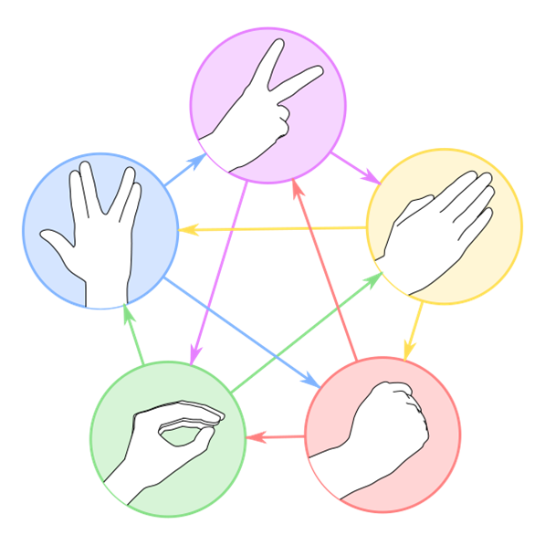

# Kata Rock Paper Scissors Lizard Spock

    
TDD

    
Switch case

    
Easy

## Descripción de la Kata

Esta Kata está basada en el juego modificado que aparece en la serie The Big Bang Theory. Se trata del clásico juego *Piedra, papel o tijera*, pero modificado con dos nuevos movimientos para aumentar el número de posibilidades en el juego.

Es una Kata sencilla de implementar y que ofrece la posibilidad de refactorizar el *switch statement* que nos irá apareciendo a lo largo de la implementación. 

### Enunciado

Las reglas son sencillas, al igual que el juego original, dos jugadores muestran a la vez un movimiento de entre 5 posibles (Piedra, Papel, Tijeras, Lagarto, Spock), si los movimientos son iguales el resultado de la partida es empate, pero si los movimientos se calculará la victoria en función de las siguientes reglas.

    

        </img>
    

    

        <b>Reglas:</b>
        <ul>
            <li><code>Tijeras</code> cortan el <code>Papel</code></li>
            <li><code>Papel</code> recubre la <code>Piedra</code></li>
            <li><code>Piedra</code> aplasta al <code>Lagarto</code></li>
            <li><code>Lagarto</code> envenena a <code>Spock</code></li>
            <li><code>Spock</code> rompe las <code>Tijeras</code></li>
            <li><code>Tijeras</code> decapitan al <code>Lagarto</code></li>
            <li><code>Lagarto</code> se come el <code>Papel</code></li>
            <li><code>Papel</code> desaprueba a <code>Spock</code></li>
            <li><code>Spock</code> vaporiza la <code>Piedra</code></li>
            <li><code>Piedra</code> aplasta <code>Tijeras</code></li>
        </ul>
    

Se pide hacer un algoritmo que dados dos movimientos calcule cual será el resultado de la partida.

### Consejos para desarrollo

+ Haremos solo una tarea a la vez. Tenemos que aprender a trabajar de forma incremental.
+ Para esta kata solo vamos a testear las entradas correctas. Por agilidad en la session.
+ Llegaremos hasta donde nos de tiempo. No se trata de terminarlo, sino de aprender durante el proceso.
+ Programaremos entre todos. No existe una solución correcta y una incorrecta, se puede hacer de muchas formas.

No te olvides de pasar los tests a cada cambio que se efectue del código, para verificar que funciona todo correctamente y que no se ha roto nada más.

## Fuente

La kata ha sido extraida de [The Big Bang Theory](https://bigbangtheory.fandom.com/wiki/Rock,_Paper,_Scissors,_Lizard,_Spock)

## Soluciones

Todas las posibles soluciones las podéis ver en el [Github de ADCSD](https://github.com/ADCSD/kata-string_calculator)

+ **Original**. Es el proyecto vacío original con el que empezar el ejercicio
+ **Kata-sesion**. Es el proyecto tal y como quedó después de hacer una sesión de `CodingDojo`
+ **Solucion**. Es el proyecto resuelto por completo que iremos viendo poco a poco en los siguientes capítulos

## Licencias

Las imagenes del tutorial han sido extraidas de [Refactoring Guru](https://refactoring.guru/).
