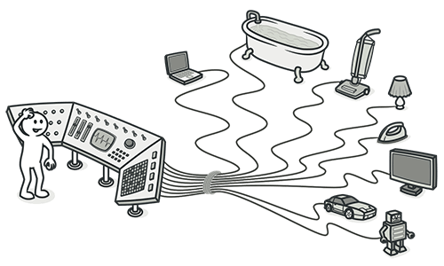

# Code Smell: `Switch Statement`

Casi todos nuestros algoritmos, tarde o temprano, van a hacer uso de operadores `switch / if`, y por tanto nos aparecerán este tipo de problemas.

Es muy fácil de detectar si en nuestro código observamos un conjunto de `switch` o `if-else` que se comporta como un grupo de acciones único.



## Problema

El problema que nos puede traer este operador es doble:

+ Dificulta la lectura del código ya que obliga al desarrollador a memorizar el stack de las clausulas anteriores.
+ Suele ser frecuente que si tenemos un operador `switch`, ese operador esté repartido en más sitios del código y por tanto, a la hora de modificar una condición, deberemos acordarnos de modificarlo varias veces.

## Tratamiento

Existen diferentes tratamientos dependiendo del tipo de condicional que tengamos, incluso a veces se pueden aplicar varios tratamientos a la vez. Dependerá mucho de la casuística que se nos presente, a continuación veremos las acciones más típicas.

### Tip 1. Decompose Conditional

<div style="text-align: right">
    <div class="md-button button-tag-mini light-green">Extract Method</div>
    <div class="md-button button-tag-mini light-green">Extract Variable</div>
    <div class="md-button button-tag-mini light-green">Magic Number</div>
</div>

#### ¿Como detectarlo?

Se da cuando vemos un condicional que es complejo o tiene muchas condiciones aunque sean sencillas.

#### Problema

El problema que nos aparece es que mientras estás ocupado averiguando lo que hace el código de dentro del bloque, olvidas cual era la condición. Y mientras estás ocupado averiguando cual era la condición, olvidas lo que hace el código de dentro del bloque. 

Obliga al cerebro a releer varias veces el mismo código hasta asimilarlo por completo. Por ejemplo:

``` Java
  if (date.before(SUMMER_START) || date.after(SUMMER_END)) {
    charge = quantity * winterRate + winterServiceCharge;
  }
  else {
    charge = quantity * summerRate;
  }
```

#### Solución

Una posible solución es descomponer las partes complicadas del condicional y separarlo en métodos diferentes: `condición`, `then`, `else`.

Al extraer el código a métodos correctamente nombrados, le estamos dando un valor semántico a las condiciones y por tanto facilitando su lectura.

``` Java
  if (isNotSummer(date)) {
    charge = quantity * winterRate + winterServiceCharge;
  }
  else {
    charge = quantity * summerRate;
  }
```


### Tip 2. Use Guard Clauses

<div style="text-align: right">
    <div class="md-button button-tag-mini light-green">Add return</div>
    <div class="md-button button-tag-mini light-green">Add throws</div>
</div>

#### ¿Como detectarlo?

Se da cuando vemos condicionales anidados que parecen simples y siguen un flujo de respuesta en bloque.

#### Problema

El problema que nos aparece es que al estar anidados, es muy dificil seguir el flujo normal de ejecución. 

Obliga al cerebro a tener que volver atrás muchas veces, para leer condiciones e identaciones de las clausulas. Por ejemplo:

``` Java
public double getPayAmount() {
  double result;

  if (isDead) {
    result = deadAmount();
  }
  else {
    if (isSeparated) {
      result = separatedAmount();
    }
    else {
      if (isRetired) {
        result = retiredAmount();
      }
      else {
        result = normalPayAmount();
      }
    }
  }

  return result;
}
```

#### Solución

Hay que identificar cuales son las clausulas que conducen a un punto terminal (generalmente con una excepción o una devolución inmediata del valor).

Una vez identificadas, se debe reorganizar el código con el objetivo de *aplanar* la estructura de código, e introducir un punto de return en las clausulas de guarda.

``` Java
public double getPayAmount() {

  if (isDead) {
    return deadAmount();
  }

  if (isSeparated) {
    return separatedAmount();
  }

  if (isRetired) {
    return retiredAmount();
  }

  return normalPayAmount();
}
```

### Tip 3. Substitute Algorithm

<div style="text-align: right">
    <div class="md-button button-tag-mini light-green">Maps</div>
    <div class="md-button button-tag-mini light-green">Lists</div>
    <div class="md-button button-tag-mini light-green">Functions</div>
</div>

#### ¿Como detectarlo?

Se da cuando hay una algoritmia clara o una correlación entre la condición y lo que hace el bloque de código.

#### Problema

Las condiciones ya nos están diciendo claramente lo que va a hacer el código. Hay una especie de duplicidad innecesaria.

``` Java
public String foundPerson(String[] people) {

  for (int i = 0; i < people.length; i++) {
    if (people[i].equals("Don")) {
      return "Don";
    }
    if (people[i].equals("John")) {
      return "John";
    }
    if (people[i].equals("Kent")) {
      return "Kent";
    }
  }

  return "";
}
```

#### Solución

Tal vez existe un algoritmo mucho más simple y eficiente que pueda realizar esa misma funcionalidad. 

A veces también se puede sustituir por `List`, `Map` o por librerías o frameworks que ya realizan esa funcionalidad.

``` Java
private List candidates = Arrays.asList(
      new String[] {"Don", "John", "Kent"});

public String foundPerson(String[] people) {

  for (int i = 0; i < people.length; i++) {
    if (candidates.contains(people[i])) {
      return people[i];
    }
  }

  return "";
}
```

### Tip 4. Use Polymorphism

<div style="text-align: right">
    <div class="md-button button-tag-mini light-green">State Pattern</div>
    <div class="md-button button-tag-mini light-green">Strategy Pattern</div>
</div>

#### ¿Como detectarlo?

Cuando tenemos que cada una de las condiciones realizan una acción diferente dependiendo del tipo de condición. Además, puede ser que esta misma estructura la tengamos varias veces repetidas en el código.

#### Problema

Si aparecen nuevos tipos de condiciones debemos crear nuevas acciones y recordar que debemos modificar todas las estructuras condionales que tengamos iguales.


``` Java

class Bird {

  public double getSpeed() {
    switch (type) {
      case EUROPEAN: return getBaseSpeed();
      case AFRICAN: return getBaseSpeed() - getLoadFactor() * numberOfCoconuts;
      case NORWEGIAN_BLUE: return (isNailed) ? 0 : getBaseSpeed(voltage);
    }

    throw new RuntimeException("Should be unreachable");
  }

  public String getColor() {
    switch (type) {
      case EUROPEAN: return BROWNISH;
      case AFRICAN: return ELECTRIC_YELLOW;
      case NORWEGIAN_BLUE: return BLUE;
    }

    throw new RuntimeException("Should be unreachable");
  }

  public double getSize() {
    ...
  }

}


```

#### Solución

Utiliando la herencia se pueden crear subclases que implementen sus propio comportamiento, mientras que en la clase base implementaremos el comportamiento estandar. Se puede implementar el `State Pattern` o el `Strategy Pattern`.

Hay que crear una clase base con el caso general y luego una subclase con cada una de las condiciones del condicional.
Luego hay que implementar los métodos necesarios en cada subclase y mover el código del condicional a la subclase.

Si aparecen nuevos tipos solo hay que implementar una nueva subclase con su comportamiento.


``` Java

class Bird {

  public double getSpeed() {

    throw new RuntimeException("Should be unreachable");
  }

  public String getColor() {

    throw new RuntimeException("Should be unreachable");
  }

  public double getSize() {
    ...
  }
}


class European extends Bird {

 public double getSpeed() {

    return getBaseSpeed();
  }

  public String getColor() {

    return BROWNISH;
  }

  public double getSize() {
    ...
  }
}

class African extends Bird {

 public double getSpeed() {

    return getBaseSpeed() - getLoadFactor() * numberOfCoconuts;
  }

  public String getColor() {

    return ELECTRIC_YELLOW;
  }

  public double getSize() {
    ...
  }
}


class NorwegianBlue extends Bird {

 public double getSpeed() {

    return getBaseSpeed();
  }

  public String getColor() {

    return (isNailed) ? 0 : getBaseSpeed(voltage);
  }

  public double getSize() {
    ...
  }
}

```


## Resultado

Hemos conseguido tener el código más organizado, más legible y por tanto más fácil de entender y modificar.
Además, es muy probable que hayamos disminuido el código duplicado.


## Excepciones

Aunque es buena práctica eliminar este tipo de `smells` hay alguna excepción donde no está aconsejado hacerlo:

+ Cuando un `switch` realiza acciones muy simples y no se repite en el código, no es necesario refactorizar en profundidad.
+ A menudo, los operadores `switch` se utilizan en los patrones `Factory Method` o `Abstract Factory` para seleccionar la clase a crear.

## Licencia 

Las imagenes del tutorial han sido extraidas de [Refactoring Guru](https://refactoring.guru/).